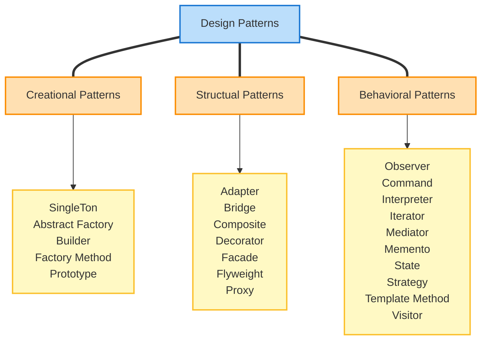

# 디자인 패턴

디자인 패턴(Design Pattern)이란 개발 시 반복적으로 등장하는 문제를 해결하기 위한 일반화 된 솔루션입니다.  
즉, 프로그래밍을 하면서 겪게되는 일반적인 문제들에 대한 구체적인 해결책을 제시하는 방법입니다.

디자인 패턴은 객체 지향 프로그래밍의 기초 지식을 전제로 합니다.  
하지만, 디자인 패턴 아이디어 자체는 프로그래밍 패러다임과 상관 없이 일반적인 상황에서도 적용할 수 있기 때문에 반드시 둘을 연관 지어 기억할 필요는 없습니다.

예를 들어 새로운 기능 하나를 추가하기 위해 파일 여러 곳을 수정해야 한다거나, 특정 아이템을 구현하기 위해 시스템 전체를 다시 수정해야 하는 상황 등이 자주 발생합니다.  
심지어는 사용하지 않는 코드처럼 보이는데 실제로는 다른 곳에서 참조되어 전체 프로그램을 점검해야 하는 경우가 있을 수 있습니다.  
이럴 때 상황에 맞는 디자인 패턴을 적용하면 훨씬 손쉽게 문제를 해결할 수 있습니다.

필요한 상황에서만 사용하는 것이 좋습니다.  
과도하게 디자인 패턴을 사용한다면, 오히려 코드의 가독성을 떨어뜨리고 유지보수를 어렵게 만들 수도 있습니다.

## 디자인 패턴의 종류

패턴의 종류는 아래와 같이 구성되어 있습니다.

### 생성 패턴

생성 패턴(Creational Patterns)은 새로운 것을 만들어내는 방법과 관련된 패턴 입니다.  
즉, 객체를 생성하는 방법과 관련된 패턴입니다.

예를 들어 공장에서 물건을 찍어내는 것에 비유할 수 있습니다.  
이 물건이 프로그래밍에선 객체가 됩니다.

### 구조 패턴

구조 패턴(Structual Patterns)은 여러 부품을 어떻게 조립하고 연결하는 방법에 대한 패턴 입니다.  
즉, 객체들의 구성을 설계하는 패턴입니다.

여러개의 객체들의 구조를 어떻게 구성할지가 이 패턴의 주 관심사 입니다.

### 행동 패턴

행동 패턴(Behavioral Patterns)은 부품이 서로 어떻게 상호작용할지에 대한 패턴 입니다.  
즉, 객체 간의 상호작용과 역할 분담을 설계하는 패턴입니다.

예를들어 특정 객체가 변할때 다른 객체들에 이 상태를 어떻게 전달할지 이런 고민들을 합니다.