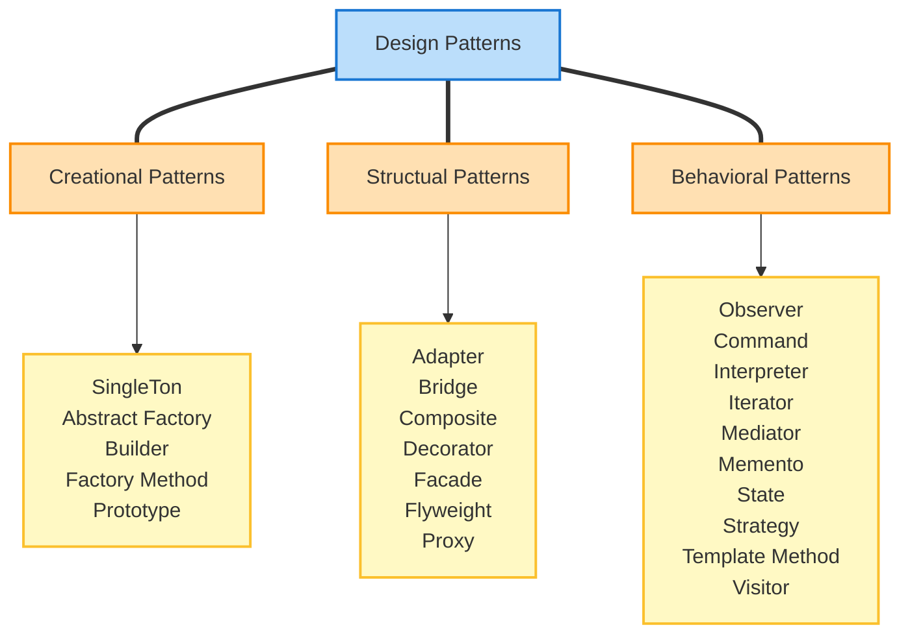

# 디자인 패턴

디자인 패턴(Design Pattern)이란 개발 시 반복적으로 등장하는 문제를 해결하기 위한 일반화 된 솔루션입니다.

패턴의 종류는 아래와 같이 구성되어 있습니다.

## 생성 패턴

생성 패턴(Creational Patterns)은 새로운 것을 만들어내는 방법과 관련된 패턴 입니다.

예를 들어 공장에서 물건을 찍어내는 것에 비유할 수 있습니다.  
이 물건이 프로그래밍에선 객체가 됩니다.

## 구조 패턴

구조 패턴(Structual Patterns)은 여러 부품을 어떻게 조립하고 연결하는 방법에 대한 패턴 입니다.  
여러개의 객체들의 구조를 어떻게 구성할지가 이 패턴의 주 관심사 입니다.

## 행동 패턴

행동 패턴(Behavioral Patterns)은 부품이 서로 어떻게 상호작용할지에 대한 패턴 입니다.  
예를들어 특정 객체가 변할때 다른 객체들에 이 상태를 어떻게 전달할지 이런 고민들을 합니다.