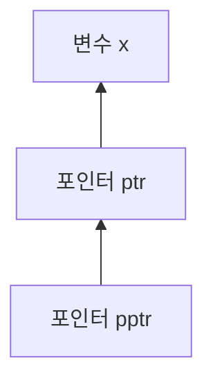

# 포인터

포인터(Pointer)는 메모리 주소를 저장하는 구조의 독립된 자료형입니다.  
포인터 자료형으로 정의한 변수가 포인터 변수이고 일반적으로는 포인터라고 합니다.  

포인터라는 단어 사용이 포인터 자료형과 포인터 변수, 두 가지를 명확하게 구분하지 않고 중복된 의미로 사용하는 경우가 많습니다.

포인터는 주소를 저장할 때, 해당 데이터가 저장된 메모리의 시작 주소를 저장합니다.

포인터 변수의 메모리 크기는 CPU에 따라 결정됩니다.  
32비트 CPU에서는 1워드(word)의 크기가 4바이트이므로, 포인터 변수의 크기 또한 4바이트가 됩니다.

컴파일러로 컴파일 할 때 크기까지 직접 명시할 수 있으며, 포인터 변수의 크기는 CPU의 종류와 컴파일할 때 사용된 컴파일러의 정책에 따라서 달라질 수 있습니다.

워드(word)란 CPU가 한 번에 처리할 수 있는 데이터의 크기입니다.  
1바이트는 32비트, 시스템에서 32비트 / 8비트 = 4바이트가 1워드(word)로 처리됩니다.  
64비트 시스템에서는 8바이트가 1워드(word)로 처리됩니다.

즉 포인터에 증가 연산자를 적용하였을 경우 증가되는 값은 타입의 크기만큼 증가해 char형에선 1바이트, short형에선 2바이트, int와 float형에선 4바이트씩, double형이면 8바이트씩 증가합니다.

절대 주소는 아두이노와 같은 엠베디드 시스템에서만 사용하며, 운영체제는 프로그램을 실행 할 때 마다 할당되는 주소가 다르게 할당되므로 절대 주소는 사용하면 안됩니다.

## 주소(adress)

메모리에서 저장공간(위치)을 구별하기 위해 주소(address)라는 용어가 사용됩니다.  
일반적인 집 주소, 메일 주소 같은 개념으로 메모리의 주소는 메모리의 저장 장소를 구별하는데 사용됩니다.  
컴퓨터 메모리의 구별은 기본적으로 바이트 단위로 이루어집니다.

예를 들어, int형 데이터는 4비트의 크기를 가지지만 데이터의 주소값은 1바이트를 가집니다.  


## 포인터 변수 선언

주소를 저장하는 변수를 할당하기 위해서는 일반 변수와 같이 포인터 변수가 선언되어야 합니다.  
포인터 변수 선언은 일반 변수 선언과 구별하기 위해 자료형과 변수명 사이에 `*` 기호를 사용합니다.

변수 선언 시 `*`를 사용하는 이유는 선언하는 변수가 일반 변수가 아닌 포인터 변수라는 것을 명시하기 위해 사용하는 기호입니다.

선언할 때 자료형을 함께 명시하는 이유는 포인터로 해당 메모리를 접근 할 때 저장된 주소를 시작으로 자료형의 크기와 데이터 해석 방식이 다르기 때문에 자료형을 함께 명시합니다.

예시는 다음과 같습니다.

```
<자료형>* <변수이름>
int* ptr; // *(asterisk)가 타입 뒤
int *ptr; // *(asterisk)가 변수 명 앞
```

`int* ptr`에서 `int*`는 포인터 자료형(type of pointer)이고 `ptr`은 포인터(variable of pointer)입니다.  
`ptr`는 데이터가 저장되어 있는 메모리 주소를 저장하고, 그 주소를 `int`자료형으로 해석합니다.

여러 개의 포인터 변수를 선언할 때는 다음과 같이 작성합니다.

```
int *p, *q, *r; // p, q, r은 모두 포인터 변수
int* p, q, r;   // p는 포인터 변수, q, r은 일반 변수
```

자료형이 void일 경우 어떤 타입의 객체든 가리킬 수 있는 포인터가 됩니다.  
하지만 어떤 자료형을 가리키고 있는지 알 수 없어서 역참조가 불가능하며 연산도 안됩니다.  
이 경우 형변환을 하면 사용이 가능합니다.

```
void* ptr;
(float *)ptr;
```

포인터를 저장하는 포인터를 만들 수 있는데 그 경우`*`를 한개 더 사용합니다.  
예시는 다음과 같습니다.

```
int x = 7;
int* ptr = &x;
int** pptr = &ptr;
```

`*`를 한개 더 사용한 `int** pptr`은 `int`자료형의 주소를 저장하는 주소가 됩니다.

`*`를 한개 더 사용해 `**`를 두개 사용했을 때의 포인터를 저장하는 포인터가 될 수 있습니다.

다음과 같이 주소를 가지고있는 구조가 됩니다.



## 포인터 변수 초기화

선언만 되고 초기화 되지 않았다면 포인터는 쓰레기값을 가지게 됩니다.  
이 상태에서 메모리의 내용을 변경한다면 문제가 생길 수 있으며 초기화를 사용하거나 `nullptr`을 사용해야합니다.

초기화를 하는 방법은 다음과 같습니다.

```
int x = 3;
int* ptr = &x;
int* ptr = nullptr;
```

포인터 값에 `0`값을 저장하면 아무것도 지정하지 않고 있다는 의미가 됩니다.  
하지만 `0`은 숫자 리터럴이며 `int`자료형 숫자값이라 포인터의 자료형과는 의미가 다르므로 C++11 표준 이후 `nullptr` 사용을 권합니다.  

`0`, `NULL`, `(void*)0`, `nullptr` 모두 자료형이 다릅니다.  32bit, 64bit 시스템과 컴파일 옵션에 따라 자료형은 달라질 수 있습니다.

## 연산자

### 주소 연산자

주소 연산자(&)는 피연산자 앞에 사용해 피연산자의 주소값을 반환합니다.  

```
int a;
char b;
&a; // a의 주소
&b; // b의 주소
```

`&`는 주소 연산자가 될 뿐만 아니라 참조 선언자로도 사용됩니다.  
주소 연산자와 의미는 관련되어 있지만 같지 않습니다.

### 간접 참조 연산자, 역참조 연산자

간접참조 연산자(*)는 역참조 연산자라고도 불리고, 사용하는 위치에 따라 다양한 용도로 사용됩니다.  
곱셈, 포인터 선언시, 메모리에 접근 할 때 사용이 됩니다.  

곱셈을 제외한 포인터 선언시 사용하는 방법은 이미 다뤘고, 메모리에 접근 할 때 사용하는 방법에 대해 다뤄보겠습니다.

포인터 변수가 선언된 후 포인터 변수 앞에 사용되는 `*`는 간접 참조 연산자로 사용됩니다.  
포인터 변수를 통해 메모리에 접근하는 것을 데이터를 간접 참조(deferencing, indirection), 역참조 한다고 합니다.

간접 참조 연산자는 포인터의 이름이나 주소 앞에 사용하여, 포인터에 저장된 주소를 접근해 저장되어 있는 값을 반환합니다.  
이때 포인터 변수가 피연산자로 쓰입니다.


포인터 변수의 메모리 주소에 접근해 저장된 값을 변경하는것도 가능합니다.  


`*`연산자는 단항 연산자로 괄호 다음으로 높은 우선순위를 가져 다른 연산자보다 먼저 실행됩니다.

### 기타 다른 연산자

주소 연산자와 역참조 연산자 외에도 다른 연산자(->, --, ++, +, -, [] 등)를 사용할 수 있습니다.

포인터 변수 역시 변수이므로 연산을 수행할 수 있는데, 값을 증가시키거나 감소시키는 등의 제한된 연산만을 할 수 있습니다.

다음과 같은 규칙들이 있습니다.

1. 곱셈, 나눗셈은 불가능 합니다.
2. 포인터끼리의 뺄셈은 두 포인터 사이의 상대적 거리를 나타냅니다.
3. 정수를 더하거나 뺄 수있고, 실수와의 연산은 허용하지 않습니다.
4. 포인터끼리 대입하거나 비교할 수 있습니다.

포인터 연산 후 각각의 포인터가 가리키고 있는 주소는 포인터의 타입에 따라 달라집니다.  
증가 혹은 감소 폭은 포인터가 가리키는 변수 타입의 크기와 같습니다.

예를 들어 int형 포인터의 증가폭은 int형 타입의 크기인 4바이트만큼 증가하게 됩니다.  
이 법칙은 포인터의 뺄셈도 같습니다.


# 포인터와 배열

배열의 이름을 포인터처럼 사용할 수 있으며 포인터를 배열의 이름처럼 사용할 수 있습니다.  
즉, 배열의 이름이 주소로 해석되며, 배열의 첫 번째 요소의 주소와 같습니다.

배열의 이름을 포인터처럼 사용하는 예시는 다음과 같습니다.

```
int arr[3] = {1, 2, 3};

std::cout << arr[0] << arr[1] << arr[2] << std::endl;
std::cout << *(arr+0) << *(arr+1) << *(arr+2);
```

배열의 인덱스를 각각 접근했을 때와 배열의 이름을 포인터처럼 사용했을 때 출력값은 각각 같습니다.  
메모리에 접근을 하고, 배열의 자료형으로 메모리를 해석하기 때문에 같은 값이 출력됩니다.

다음과 같은 공식이 성립하며 다차원 배열에서도 성립합니다.
```
// arr이 배열의 이름이거나 포인터이고, n이 정수라면
arr+n == &arr[n];
arr[n] == *(arr + n);
```

포인터를 배열의 이름처럼 사용하는 예시는 다음과 같습니다.


포인터를 배열의 이름처럼 사용했을 때와 배열의 인덱스를 각각 접근했을 때 같은 값이 출력 됩니다.  
그 이유는 같은 메모리에 접근하고, 같은 자료형으로 해석하기 때문입니다.

# const와 포인터

`const`라는 키워드는 변수를 상수화 할 때 사용하는 키워드입니다.  
이 키워드를 포인터에도 사용이 가능한데, `const`의 위치에 따라 의미가 달라집니다.

가장 먼저 변수에 `const`키워드를 사용한 경우입니다.


포인터를 지정하려고 하면 Compile Error가 발생합니다.  
이유는 `*ptr = 7`이런 식으로 값을 변경할 수 있어 상수라는 개념에 위반돼 이런 포인터는 허용되지 않습니다.

그래서 `const int`의 주소를 저장하는 포인터를 사용하고자 한다면 포인터의 자료형 앞에 `const` 키워드를 사용해야합니다.  
이는 저장된 주소의 메모리를 상수로 본다는 것입니다.  
메모리를 상수로 해석하므로 역참조를 이용해 값을 변경할 수 없게 됩니다.  
포인터가 저장하고 있는 주소를 변경하는 것은 가능합니다.

다음은 예시입니다.


포인터의 자료형 뒤에 `const` 키워드가 사용됐을 경우입니다.  
포인터 자체가 상수가 되고, 상수 포인터라고 합니다.  
상수 포인터는 초기화 후 가리키는 주소를 변경 할 수 없는 포인터입니다.  
포인터가 상수일 뿐 변수는 상수가 아니므로 역참조하여 값을 변경할 수 있습니다.

```
int* const ptr = &number;
*ptr = 30;
```

마지막으로 자료형 앞뒤로 `const` 키워드가 사용됐을 경우입니다.  
변수를 상수로 가리키는 상수 포인터가 되며 다른 주소를 가리키도록 사용 할 수 없고, 역참조를 통해 값을 수정 할 수 없습니다.  
선언 시 초기화 해야하며, 항상 같은 주소를 가리킵니다.

```
const int* const ptr = &number;
```