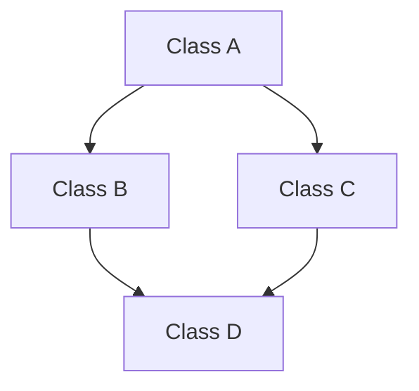

# 상속

상속(Inheritance)은 기존 클래스의 속성과 메소드를 새로운 클래스가 물려받아 재사용하거나 확장하는 기능을 말합니다.

이때 기존 클래스는 기초 클래스(base class), 부모 클래스(parent class), 상위 클래스(super class)라고 불립니다.  
상속을 받는 새로운 클래스는 파생 클래스(derived class), 자식 클래스(child class), 하위 클래스(sub class)라고 불립니다.

상속은 객체 지향 프로그래밍(OOP)의 중요한 개념입니다.  
코드의 재사용성을 향상시키거나 확장하는 역할을 합니다.

상속 계층이 복잡해지면 코드의 유지보수가 어려워질 수 있습니다.

## 상속 선언

상속하는 선언은 다음과 같습니다.

```cpp
class 부모 클래스
{

};

class 자식클래스 : 접근제어지시자 부모클래스
{

};
```

위 코드의 `자식클래스`는 `부모클래스`를 상속받습니다.  
따라서 `자식클래스`는 `부모클래스`의 멤버 변수와 함수를 사용할 수 있습니다.  

하지만 상속 시 접근 제어 지시자에 따라 부모 클래스의 멤버에 대한 접근 수준이 달라집니다.

||public 상속|protected 상속|private 상속|
|---|---|---|---|
|public 멤버|public|protected|private|
|protected 멤버|protected|protected|private|
|private 멤버|private|private|private|

위의 표처럼 `public` 상속을 할 경우 부모 클래스의 멤버들에 대한 접근 제어 지시자가 변경되지 않습니다.  
`protected`로 상속을 할 경우 부모 클래스의 멤버들 중 `public` 제어 지시자를 가진 멤버만 `protected`가 됩니다.  
하지만 `private` 상속을 할 경우 기존 멤버들에 대한 접근 제어 지시자가 최대한 제한되어 모든 멤버가 `private`가 됩니다.

또한 상속 시 접근 제어 지시자는 자식 클래스 내부에서의 접근 수준에 해당하며, 외부에서는 부모 클래스의 `public`멤버만 접근이 가능합니다.

상속을 사용하고 출력을하는 예제코드입니다.

```cpp
#include <iostream>

class Animal
{
public:
	Animal(std::string name, int age) : Name(name), Age(age) {}
	void print()
	{
		std::cout << "이름: " << Name << std::endl;
		std::cout << "나이: " << Age << std::endl;
	}

private:
	std::string Name;
	int Age;
};

class Dog : public Animal
{
public:
	Dog(std::string name, int age) : Animal(name, age) {}
};

int main()
{
	Dog ADog("리트리버", 3);
	ADog.print();
}
```

출력은 다음과 같습니다.


`Dog`클래스에서는 생성자를 제외한 아무런 기능을 가지고 있지 않지만 `Animal`클래스를 상속받아 멤버 변수와 함수를 사용하는 것을 알 수 있습니다.

## 다중 상속

다중 상속(Multiple Inheritance)은 하나의 클래스가 두 개 이상의 부모 클래스로부터 상속받을 수 있는 기능을 말합니다.  
즉 자식 클래스는 여러 부모 클래스의 멤버 변수와 멤버 함수를 모두 상속받을 수 있습니다.

다중 상속을 하는 선언은 다음과 같습니다.

```cpp
class 부모 클래스1
{

};

class 부모 클래스2
{

};

class 자식클래스 : 접근제어지시자 부모클래스1, 접근제어지시자 부모클래스2, ...
{

};

class Engine
{

};

class Handle
{

};

class Wheels
{

};

class Car : public Engine, public Handle, public Wheels
{

};
```

위의 예시와 같이 기존의 상속에 `,`를 사용하고 다른 부모 클래스와 그 부모 클래스에 대한 접근 제어 지시자를 작성해주면 됩니다.

### 다이아몬드 상속

다중 상속에는 대표적으로 다이아몬드 상속 문제가 있습니다.  
다이아몬드 상속 문제란 클래스의 상속 계층 구조가 다이아몬드 모양을 이루기 때문에 붙여진 이름입니다.

예시 클래스는 다음과 같습니다

```cpp
class A
{

};

class B : public A
{

};

class C : public A
{

};

class D : public B, public C
{

};
```

위의 경우가 다이아몬드 상속이 이루어진것이며, 그림으로 표현하면 다음과 같습니다.



이런 다이아몬드 상속의 경우 `D`클래스가 `A`클래스의 멤버를 두 번 상속받아 동일한 멤버가 중복으로 존재하게 됩니다.  
또한 `D`클래스에서 `A`클래스의 멤버를 호출하려고 할 때, `B`를 통해 상속된 멤버인지 `C`를 통해 상속된 것인지 알 수 없어 오류를 발생시킵니다.  
중복된 멤버로인해 메모리가 낭비되고, 유지 보수가 복잡해질 수 있습니다.

해당 문제를 해결하는 방법으로는 가상 상속과 인터페이스가 있습니다.
하지만 다이아몬드 상속을 유지한 상태에서 모호한 상태의 멤버를 호출하려고 할경우 명시적 범위 지정 방식을 사용해 `B::멤버` 혹은 `C::멤버`로 호출하면 모호한 멤버에 대해 명확해지므로 호출이 가능합니다.

## 가상 상속

가상 상속(Virtual Inheritance)은 다이아몬드 문제를 해결하기 위한 상속입니다.  
다이아몬드 상속의 경우 해당 가상 상속을 사용하면 상위 클래스의 멤버를 한 번만 상속받게 됩니다.

가상 상속은 메모리와 성능에 추가적인 오버헤드를 발생시킬 수 있습니다.

가상 상속을 선언 방법은 다음과 같습니다.
```cpp
class A
{

};

class B : virtual public A
{

};

class C : virtual public A
{

};

class D : public B, public C
{

};
```

상속 할 때 접근 제어 지시자 앞에 `virtual`키워드를 사용하여 상속을 선언하여 사용 가능합니다.

위의 예시의 경우 `B`와 `C`의 상속에서 `virtual`키워드를 사용해 가상 상속을 했습니다.  
이 경우 `D`에서 `B`와 `C`를 상속 받지만 `A`에서 멤버를 한번만 상속 받아 중복되는 인스턴스를 피할 수 있습니다.

`B`와 `C`는 `A`의 단일 인스턴스를 공유하게 됩니다.

가상 상속을 사용하는 경우 `A`의 생성자는 예시 구조에서는 `D`에서 호출되어야 합니다.  
`B`와 `C`는 `A`의 생성자를 호출하지 않고, `D`가 역할을 합니다.  
만약 명시적으로 호출하지 않을 경우 컴파일러가 자동으로 호출합니다.