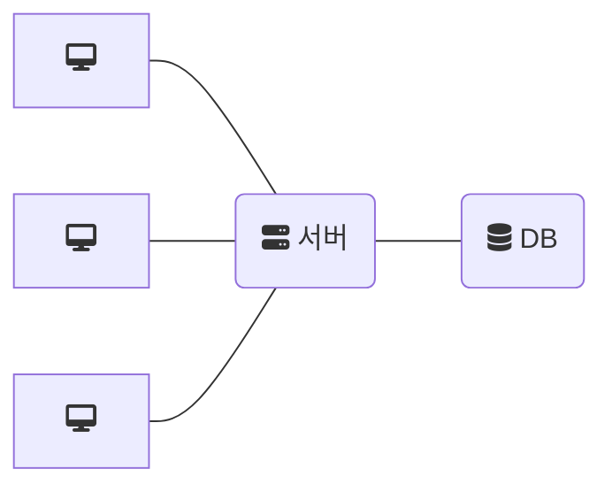
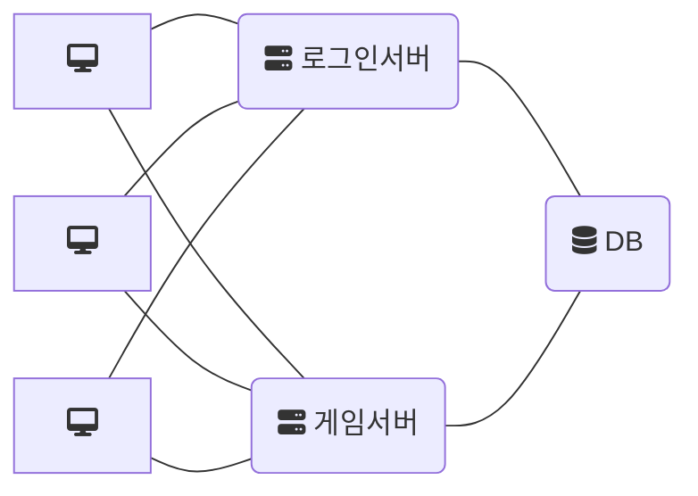
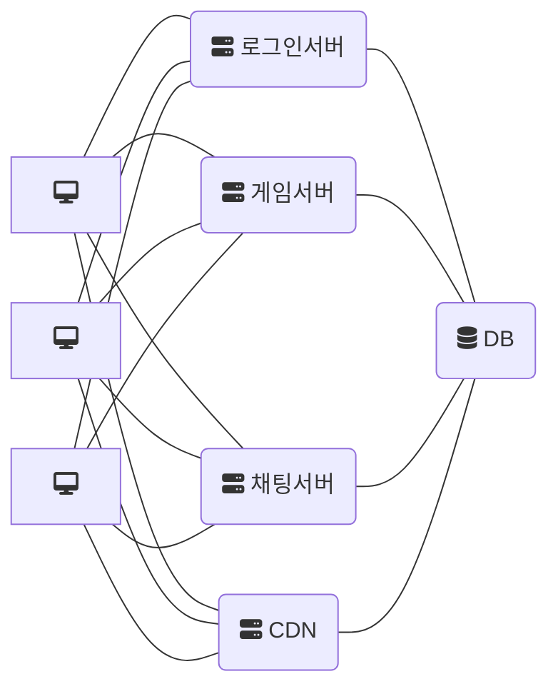
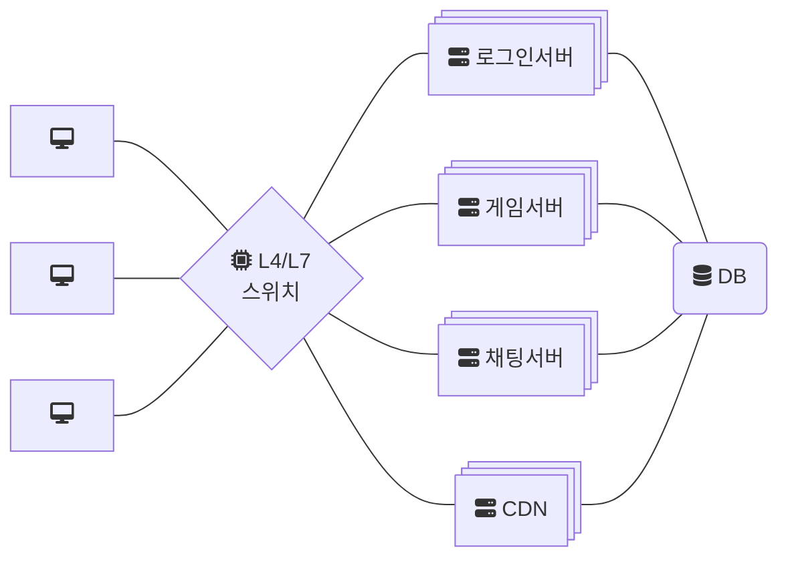
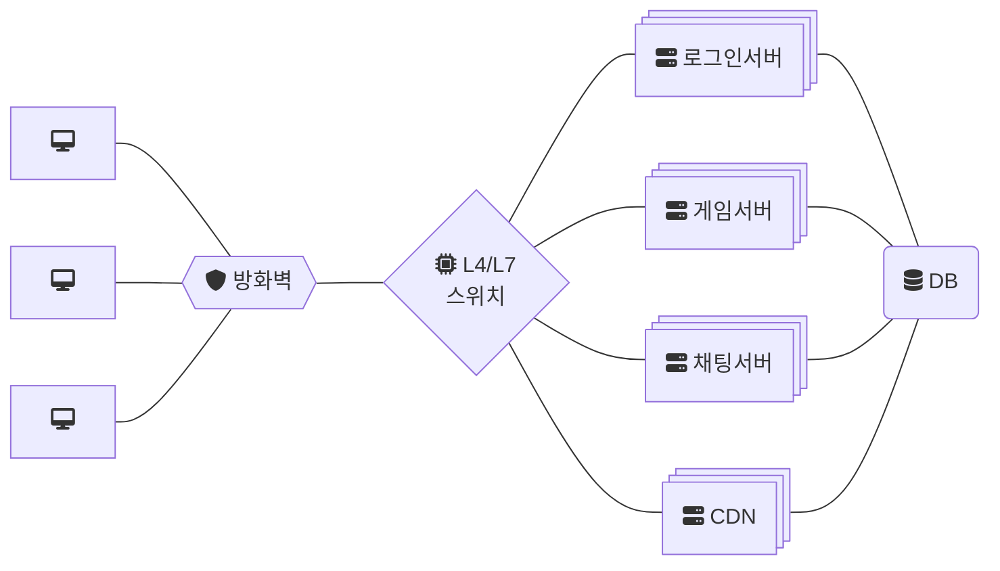
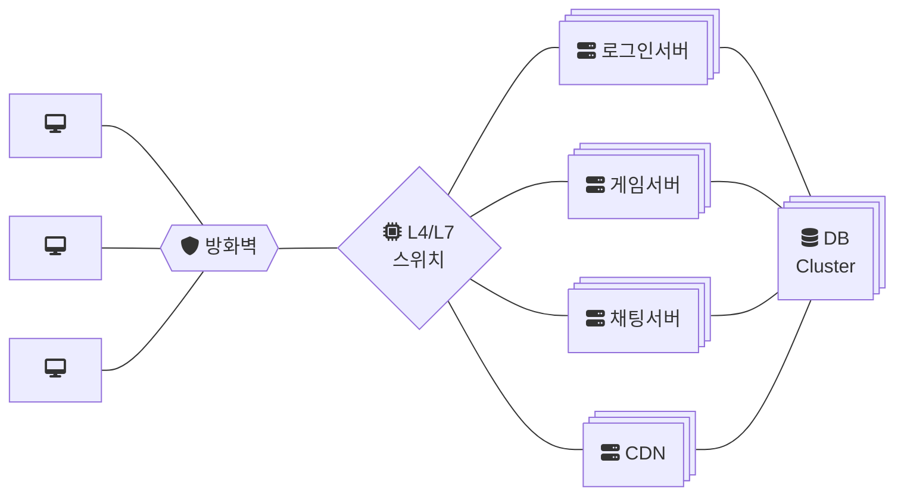
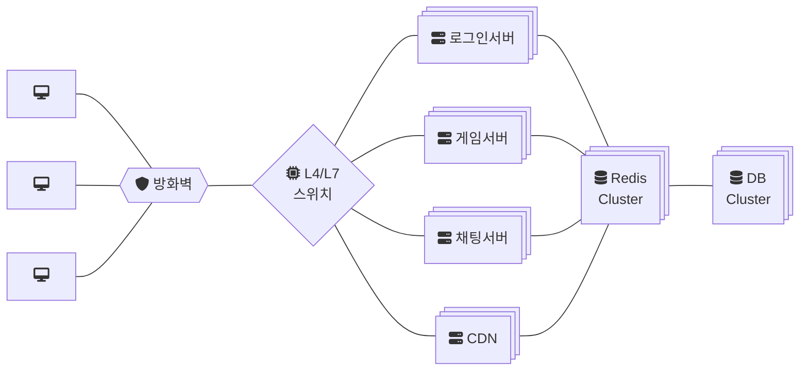
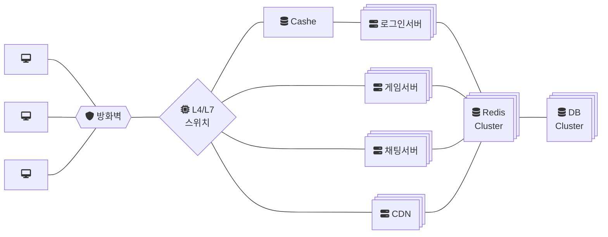
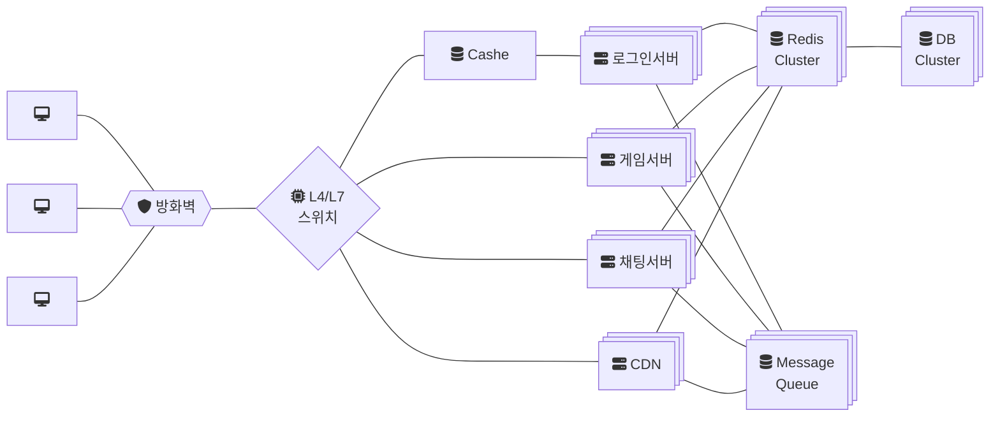

# 온라인 게임의 네트워크 구성

온라인 게임은 여러명의 사용자가 인터넷을 통해 동시에 접속하여 하나의 콘텐츠(Contents)를 공유하는 게임을 말합니다.  
장르를 떠나, 크게 보면 실시간과 어싱크 방식 2가지로 나뉘며, 실시간은 온라인 서버(클라우드) 환경과 LAN 파티 환경으로 나뉩니다.

온라인 게임의 네트워크 방식은 주로 동기(Synchronous) / 비동기(Asynchronous) 방식으로 나눌 수 있습니다.  
각각의 방식은 게임의 특성과 요구사항에 따라 선택되며, 장단점이 있습니다.

## 싱크

싱크(Synchronous/Sync) 방식은 모든 클라이언트가 동일한 타이밍에 동일한 상태를 유지하도록 하는 방식입니다.  
일반적으로 서버가 권위(authority)를 가지며, 모든 클라이언트는 서버의 상태를 따라가도록 구현됩니다.

온라인 서버(클라우드) 환경과 LAN 파티 환경으로 나뉩니다.

클라이언트는 서버에서 보내주는 데이터(위치, 행동 등)를 받아서 모든 클라이언트가 동일한 상태를 유지하도록 동기화됩니다.  
즉, 지속적인 데이터 교환을 통해 실시간 업데이트됩니다.

+ 장점
    + 정확한 동기화로 클라이언트 간의 상태 차이가 거의 없습니다.
    + 서버에서 모든 로직을 검증하여 해킹이 어렵기 때문에 치트 방지에 유리합니다.
+ 단점
    + 네트워크 부하가 크고, 지연(Lag)에 민감하기 때문에 네트워크 패킷 손실이나 지연이 발생하면 전체 게임이 멈출 수도 있습니다.

Lockstep(락스텝) 방식이 대표적입니다.  
RTS(실시간 전략 게임)과 턴제 게임에서 많이 사용됩니다.

동기, 실시간, 리얼타임이라고도 불립니다.

## 어싱크

어싱크(Asynchronous/Async) 방식은 클라이언트가 서버의 데이터를 기다리지 않고 독립적으로 동작하면서 주기적으로 서버와 동기화하는 방식입니다.  

서버에서 일정 주기로 동기화를 보내어 잘못된 예측을 보정합니다.  
클라이언트는 자체적으로 예측(Prediction)을 수행하며, 서버의 응답을 기다리지 않고 동작합니다.

대표적인 기법으로 클라이언트 보간(Interpolation), 예측(Prediction), 보정(Correction) 등이 있습니다.

+ 장점
    + 네트워크 지연과 관계없이 즉각적으로 반응하기 때문에 빠른 반응 속도를 가집니다.
    + 서버 동기화를 기다릴 필요가 없어 게임이 끊기지 않기 때문에 부드러운 플레이 경험을 보일 수 있습니다.

+ 단점
    + 예측이 틀릴 경우 순간적인 위치 이동(텔레포트) 같은 현상이 발생할 수 있습니다.
    + 클라이언트가 데이터를 예측/보정하는 과정에서 해킹에 노출될 가능성이 있습니다.

FPS, MOBA, 레이싱 게임과 같이 빠른 반응이 필요한 게임에서 사용됩니다.

비동기라고도 불립니다.

## CAP 이론

분산 시스템의 동기화 조건 3개를 모두 만족하는 시스템은 없다는 이론 입니다.

+ Consistency(일관성): 전체 시스템은 동일한 상태 값을 갖고 있어야 합니다.
+ Availability(가용성): 언제든지 시스템에 접근하여 값을 읽고 쓸수 있어야 합니다.
+ Partition Tolerance(분할 용인): 시스템을 분할하여 병렬처리 등이 가능해야 합니다.

일관성과 가용성을 만족한다면 분할 용인을 포기해야합니다.  
가용성과 분할 용인을 만족한다면 일관성을 포기해야합니다.  
일관성과 분할용인을 만족한다면 가용성을 포기해야합니다.

## 동기화 방법

게임 동기화의 관건은 여러 대가 묶여 있는 시스템의 상태를 동일하게 유지하는 것입니다.

초기 온라인 게임은 일관성을 유지하고 가용성을 포기합니다.  
사용자의 입력을 서버로 보내서 일정 시간(Round 또는 Tick : 0.333 ~ n 초)마다 클라이언트로 브로드캐스팅(Broadcasting)하여 수신 받은 이벤트로 게임 클라이언트의 상태를 업데이트 처리합니다.  
빠른 반응 속도가 필요 없을 때 비교적 쉽게 구현 가능합니다.

이후에 다수의 사용자가 게임을 동시 실행하는 MMO, FPS, Sports와 같이 반응성이 우선인 게임 장르의 경우 기본적인 캐릭터의 이동 등은 Round (또는 Tick)을 짧게 브로드캐스팅(Broadcasting)하고, 실시간으로 별도의 채널을 통해 다중 브로드캐스팅 방식으로 진화해 왔습니다.  
사용자가 컨트롤(Control)하고 있는 클라이언트를 먼저 업데이트하기 때문에 가용성을 우선하고, 일관성은 포기합니다.

### 가용성 보정

가용성을 포기하고 일관성을 우선으로 하는 CP (또는 PC)설계의 대표적인 게임에는 스타크래프트가 있습니다.

스타크래프트에서 마린을 움직였다고 가정해볼 경우 클라이언트 내부에서는 다음과 같습니다.

1. 마우스를 클릭한다.
2. 게이머에게 피드백하며, 서버에 이벤트를 전송한다.
3. 서버가 브로드캐스팅한 데이터로 클라이언트가 상태를 업데이트 한다.

이때 플레이어가 입력한 이벤트 시간과 서버에서 오는 데이터를 수신하는 시간 간의 Gap이 발생합니다.  
그래서 옛 게임들은 클라이언트 업데이트 이전에 플레이어에게 사운드나 이펙트로 줘서 기다리는 시간이 없는 것처럼 위장했습니다.

하스 스톤, 체스, 장기, 고스톱 ⇒ 플레이어의 입력이 끝날 때까지 다른 플레이어의 입력을 차단합니다.

### 일관성 보정

일관성을 포기하고 가용성을 우선으로 하는 AP(PA) 설계의 대표적인 게임 최근에 등장하는 게임들은, 게임 클라이언트를 우선 업데이트하고, 후에 일관성을 보정하는 방법을 사용합니다.

응답속도(Latency)가 낮을 경우 게임을 하다 보면 뒤에 잘 숨었는데 뒤늦게 죽는 경우나, 갑자기 캐릭터가 뒤로 가는 경우 등이 발생합니다. 

대표적으로 포트나이트에서 클라이언트 예측, 서버 조정을 사용합니다.
- 예측과 서버 값이 맞으면 그대로 진행합니다.
- 예측과 서버 값이 틀리면 서버값으로 반영합니다.

AP 설계의 특징은  특정 플레이어가 응답속도가 떨어지더라도 세션을 그대로 유지됩니다.

### 클라이언트 보간

네트워크는 강하게 결합되어 있지 않으며, 불안정한 전기 신호입니다.  
따라서, 1/20 초 마다 브로드캐스팅되는 데이터가 클라이언트에서 1/20초 마다 도달한다고 생각하면 문제가 사용자경험(UX)에 좋지 않은 영향을 주기 때문에 클라이언트에서는 보간을 합니다.

Unreal은 내부적으로 자동으로 처리해줍니다.

1. 서버 데이터 수신: 서버는 일정 간격(예: 50ms마다)으로 캐릭터의 위치를 클라이언트에 전송합니다.
    + 예: t = 0초에 (x = 0, y = 0), t = 0.05초에 (x = 5, y = 0)
2. 클라이언트 버퍼링: 클라이언트는 수신된 위치값을 바로 렌더링 하지 않고, 약간의 지연(예: 100ms)을 두고 버퍼에 저장합니다.
    + 이는 네트워크 지터(Jitter, 패킷 도착 시간 변동)를 보정하고 보간에 사용할 데이터를 확보하기 위함입니다.
3. 클라이언트는 두 위치값 사이를 시간 비율에 따라 계산합니다.
- 예: t = 0.025초일 때, (x = 0, y = 0)와 (x = 5, y = 0) 사이를 보간하면 중간 위치 (x = 2.5, y = 0)
4. 렌더링: 매 프레임(예: 60FPS, 약 16.6ms 간격)마다 보간 된 위치를 화면에 반영해 부드러운 이동 구현합니다.

## 채팅 서버와 온라인 게임 서버

유사점
- 사용자의 입력을 전체 사용자에게 브로드캐스팅합니다.
- 사용자의 세션을 관리합니다.
- 채널(또는 서버) 별로 다른 상태를 가집니다.
- 채널을 선택하거나, 내 아바타를 커스텀 하거나, 친구 목록을 보는 등의 로비가 있습니다.

차이점
- 채팅에서는 사용자를 그래픽으로 표현하지 않습니다.
- 채팅에서는 사용자의 상태를 그래픽으로 표현하지 않습니다.
- 게임은 승과 패, 성공과 실패가 그래픽으로 표현됩니다.
- 채팅은 데이터 량이 작으므로 접속이 끊겨서 새로 접속하면 채널의 모든 정보를 줄 수도 있습니다.
- 채팅은 낮은 Latency를 고려하지 않지만, 게임 서버는 경우에 따라 고려(클라이언트 예측과 서버 보정) 합니다.

## 네트워크 구성

작은 규모의 경우 서버 1대로 DB까지 구성했지만, 제대로 된 서비스는 DB 만큼 분리하였습니다.

네트워크 시스템에서의 가장 큰 적은 병목(Bottleneck) 현상입니다.  
다른 서버는 노는데 어느 한 서버는 과부하가 걸려서 전체 시스템의 성능이 떨어지는 현상을 말합니다.

이 때문에 DB 서버를 분리하였습니다만, 사용자의 로그인이 많은 시스템의 경우 로그인 서버만 따로 분리하기도 합니다.  
로그인 서버에서 생성한 인증, 사용자 정보 등의 세션을 가지고 게임 서버로 접속하는 방식을 사용했습니다.

채팅량이 많아지거나 업데이트가 빈번해지며 각각 서버를 분리하기로 했습니다.

이후로 게임 서버의 증설이 필요해집니다.  
서버와 서버의 동기화는 대단히 많은 동기화 시간을 필요로 하기 때문에, 노는 서버에게 트래픽을 더 몰아주거나 서버가 장애가 발생하였을 때 전체 시스템 마비를 막기 위한 장비가 필요하게 됩니다.

방화벽을 설치하여 해킹을 적극적으로 차단하기로 했습니다.

이정도 되면 사용자의 폭증으로 DB가 혼자 못 버티는 상황이 됩니다.  
그래서 DB 클러스터(NoSQL과 같은 분산 DB 또는 Active-Active 모드의 Replication DB)를 적용하기로 했습니다.

분산 DB를 구성한다는 건, 저장소(Disk)를 공유하거나, DB 서버간 데이터를 항상 동기화해야 하는 문제가 생깁니다.  
DB의 잦은 사용을 대신해 줄 수 있는 무언가가 필요하게 됩니다.  
그래서 등장한 솔루션이 메모리 캐쉬 서버입니다. (Redis, Memcached)

로그인 서버에도 과부하가 걸립니다.  
그래서 캐시 서버를 적용했습니다.

이번에는 채팅 서버와 게임 서버 등 서버 간의 통신이 소실되는 경우가 생깁니다.  
한쪽 서버가 과부하가 걸려서 못 받는 경우 또는 사용자에게 전체 메시지를 보내야 하는 경우 등을 위해 Message Queue (RabbitMQ)를 적용합니다.

매치메이킹, 결재 서버 등의 부가 기능이 붙으면 더 복잡한 구조가 형성됩니다.