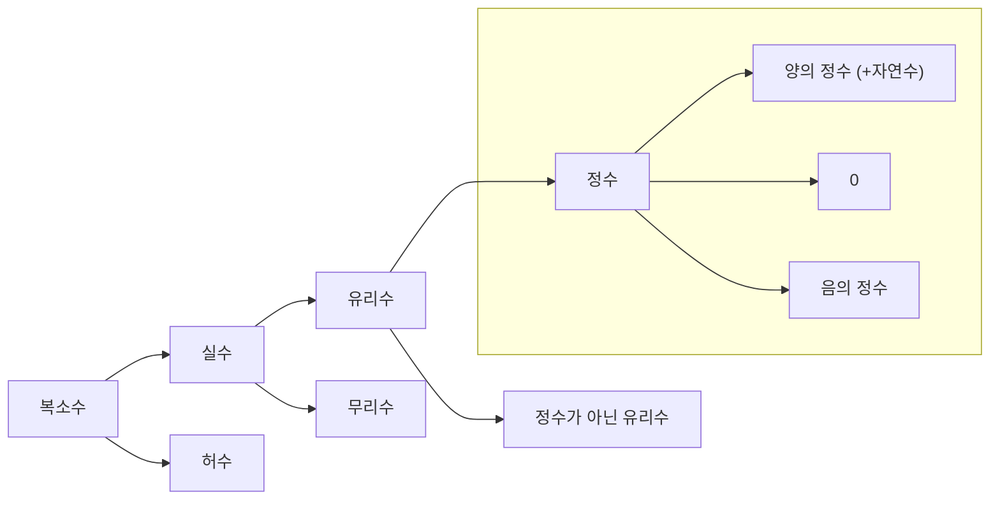

# 수의 체계

## 자연수

자연수(Natural Number)는 1부터 시작하는 양의 정수를 뜻합니다.  
물건의 개수를 셀 때 사용하는 가장 기본적인 수입니다.

$1$, $2$, $3$과 같이 양의 정수로 이루어져 있습니다.

집합 기호로는 $\mathbb{N}$ 로 표기합니다.  
$0$을 포함하는 경우 $\mathbb{N}_{0}$, 양의 정수만 의미할 때는 $\mathbb{N}^{*}$, $\mathbb{N}^{+}$를 사용하기도 합니다.

## 정수

정수(Integer)는 자연수에 0과 음의 정수를 포함한 수의 집합입니다.

$\ldots, -2, -1, 0, 1, 2, \ldots$와 같이 양수와 음수를 모두 포함합니다.

집합 기호로는 $\mathbb{Z}$로 표기합니다.  
양의 정수는 $\mathbb{Z}^{+}$ 또는 $\mathbb{N}$, 음의 정수는 $\mathbb{Z}^{-}$, 0이 아닌 정수는 $\mathbb{Z}^{*}$로 표기합니다.

## 유리수

유리수(Rational Number)는 두 정수의 비율(분수)로 표현할 수 있는 수입니다.

정수뿐만 아니라 $\frac{1}{2}, \frac{-3}{4}$ 같은 분수, 그리고 유한소수와 순환소수도 포함됩니다.

집합 기호로는 $\mathbb{Q}$로 표기합니다.

## 실수

실수(Real Number)는 수직선 위에 표현할 수 있는 모든 수를 의미합니다.

유리수뿐만 아니라 $\sqrt{2}, \pi$와 같이 분수로 표현할 수 없는 무리수도 포함합니다.

집합 기호로는 $\mathbb{R}$로 표기합니다.  
양의 실수는 $\mathbb{R}^{+}$, 음의 실수는 $\mathbb{R}^{-}$, 0을 제외한 실수 집합은 $\mathbb{R} \setminus {0}$ 또는 $\mathbb{R}^{*}$로 표기합니다.

무리수 집합 기호는 $\mathbb{R} \setminus {Q}$로 표기합니다.

## 복소수

복소수(Complex Number)는 실수에 허수를 포함한 확장된 수 체계입니다.

실수로 표현할 수 없는 $\sqrt{-1}$과 같은 개념을 포함하며, 모든 수를 표현할 수 있는 가장 넓은 범위의 수입니다.

집합 기호로는 $\mathbb{C}$로 표기합니다.

허수는 별도의 정해진 집합 기호가 없으나 허수 단위 기호로서 $i$를 사용합니다.